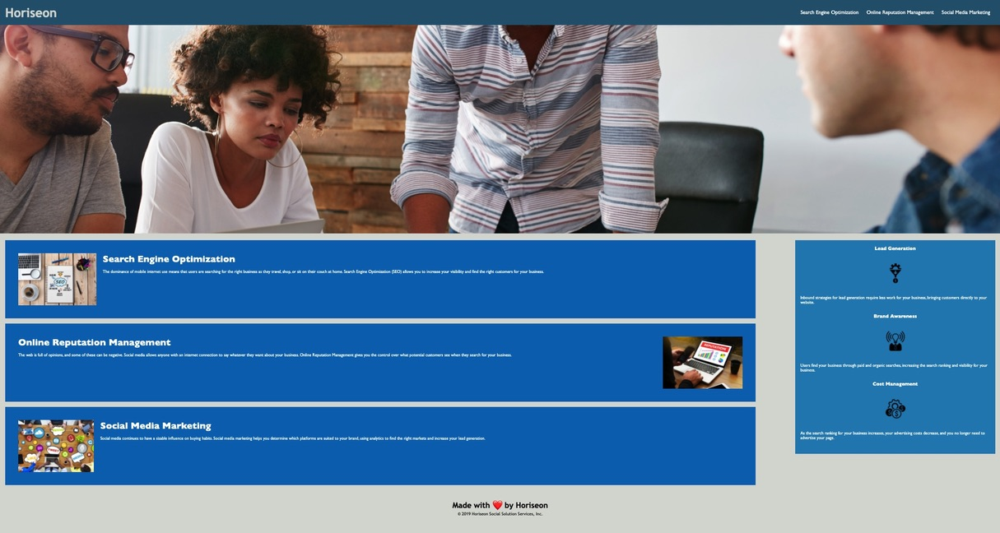

<Code Refractor Project>
 # code-refractor

## Contents for Code Refractor
1. Overview
2. Benifits of Refractoring
3. Project Goals
4. Meeting Goals
5. Knowledge Gained
6. Image of Horiseon Website
7. Link to the Web Page
8. Credits

### 1. Overview
Refractoring website using semantic elements and simplifying CSS.

### 2. Benifits of Refractoring
Refractoring improves the design of a website making it easier to understand and helps to find bugs in the code. This can also make the site run more efficiently.

### 3. Project Goals 
The goal of this project was to refractor a website using semantic elements and to update the page to make it more universally useful. In this project is stuck to "boyscout rule" of making the code better than when I found it. This means increasing site assessibility. The site in the end should work more efficiently and be easier to read.

### 4. Meeting Goals
I simplified the html and CSS and replaced it with semantic code that is easier to read and follow. This project allowed me to grow my skills as a coder. I simplified overyly complex code and fixed internal page links so that the page is more assessable for navigation. I added alt attributes to the images to make the content more assessable. I fixed links in the page to make it easier to navigate. I also added alt descriptions of all images on the page to make the page more assessible.

In addition, I replaced div elements with the following semantic elements: -header -footer -main -section -figure -article -aside.

### 5. Knowledge Gained
 Using semantic elements made the html code easier to read and allowed . The CSS had repeating style elements that were simplified by using references to semantic elements used in the updated html. I learned a lot through trial and error. I believe this experience has helped me build skills needed to be a great web developer. I am ready to take these skills and apply them to future code refractoring projects.

 This project is significant because the website code is improved from the greatly from the original website. It should be noted that I frequently pushed my work to github with comments. I pushed my work to github over 40 times. I believe this shows I am actively working to become a better coder.

### 6. Image of Horiseon Website

### 7. Link to the Web Page
  Click the following link to visit the website [Horiseon Refractored Code](https://grave019.github.io/code-refractor/)

### 8. Credits
Thank you for taking the time to view my code refractor project. If you have any ideas on how to make the website better please feel free to submit a pull request.